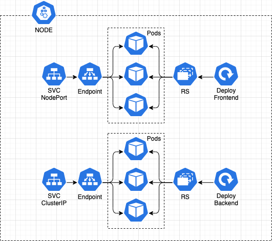

# Proyecto

Para poner en práctica el conocimiento de k8s se hará una app web con back en Go y front con JS, siguiendo la siguiente arquitectura: 



## Desarrollo

* Estructura
    ```
    |_proyecto
        |_backend
            |_src
                |_main.go
            |_backend.yaml
            |_Dockerfile
        |_frontend
            |_src
                |_index.html
            |.yaml
            |_Dockerfile
        |_notes.md
    ```

# Backend

## Armar imagen Docker

* Ir a la carpeta `./backend/src`
* Crear contenedor Go en docker
    ```bash 
    docker run --rm -dti -v $PWD/:/go --net bridge -p 9090:9090 --name golang golang:alpine sh 
    ```

    *   `--rm` es para que el contenedor se elimine luego de salir del mismo

* Ejecutar `main.go`
    ```bash
    docker exec -ti container_name sh
    go run main.go
    ```

    > Se debe verificar en `localhost:9090`

*   Construir la imagen

    ```bash
    docker build -t k8s-go-app -f Dockerfile .
    ```

## Armar manifiesto de kubernetes
  
* Revisar archivo `/backend/backend.yaml`

* Ejecutar configuracion
    ```bash
    kubectl apply -f backend.yaml
    ```

> Como el servicio se creó como `ClusterIP`, solo se le puede hacer request desde algún pod interno al cluster con `curl nombre_del_svc`

> Con macOS no se puede acceder con la IP del pod al mismo por lo que los servicios deben estar expuestos y tienen que ser `NodePort`


# Frontend

> El proceso es básicamente el mismo que con el backend.

* Armar una web `index.html` que consuma la api 

    > En caso de macOS, el fetch se hace a localhost y el puerto del rango 30K que genera el svc NodePort. Si es ClusterIP se puede consultar al IP interno de svc de backend.

* Una vez armada y probada, construir el `Dockerfile` que solo levanta la imagen de `nginx:stable-alpine` y le hace un `COPY` de la ruta del archivo `index.html` a la ruta raiz de nginx

* construir la imagen

    ```bash
    docker build -t k8s-go-app-front -f Dockerfile .
    ```

### Construir manifiesto

* Revisar archivo `/frontend/frontend.yaml` (ver comentarios). Revisar tags y que la imagen se llame igual a la que construimos arriba.

* Ejecutar configuracion

    ```bash
    kubectl apply -f frontend.yaml
    ```

> Consultar con `localhost:puerto(30000)` 
